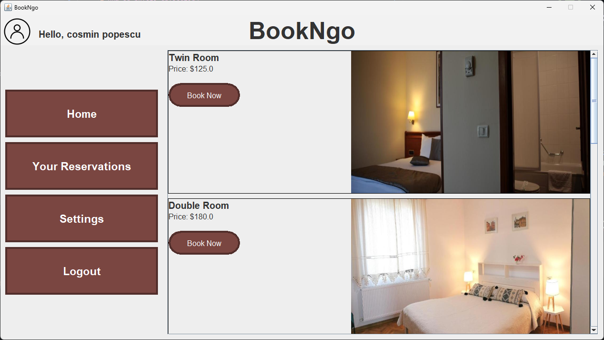
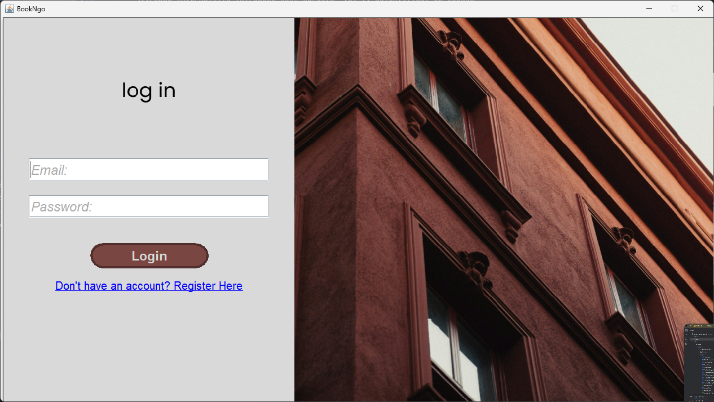
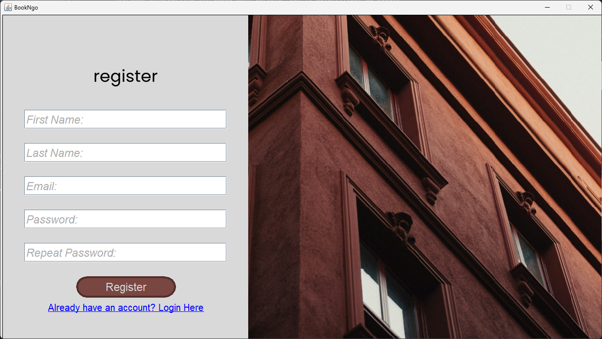
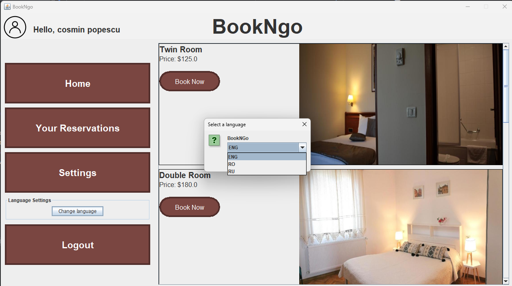
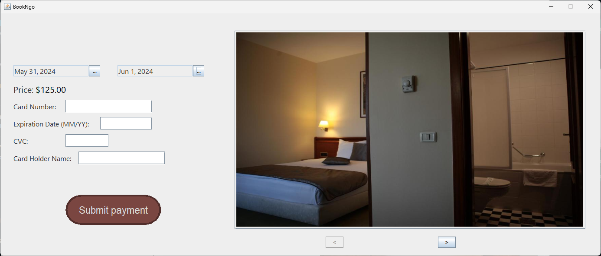
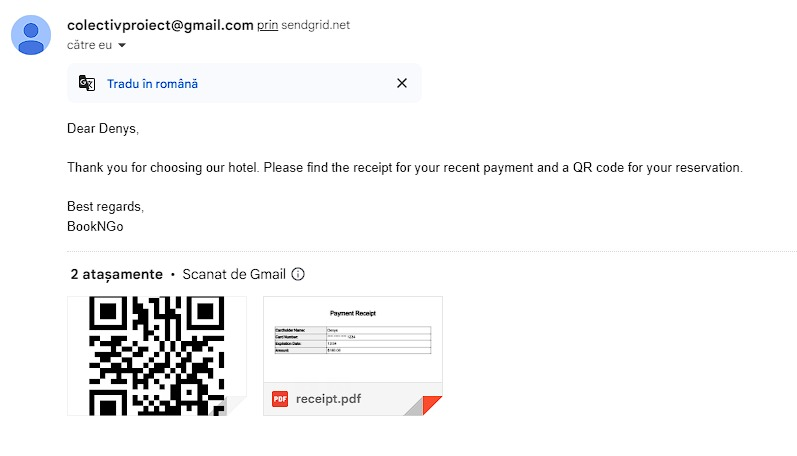

<h1 align="center"><strong><em>bookNGo</strong></em></h1>

# Cum să rulezi aplicația?

Pentru a rula această aplicație: 
 

* Trebuie să ai Java instalat. Poți descărca Java de aici: <a href="https://www.java.com/en/">Link</a>
* După aceea, accesează secțiunea <a href="https://github.com/reD0xcs/bookNgo/releases">Releases</a> și descarcă ultima versiune a aplicației.
* Dă clic dreapta pe folderul arhivat salvat pe computerul tău și alege "Extract All". Rulează aplicația și bucură-te!

<h1 align="center"><strong>Demonstrație</strong></h1>

# Login

Pentru a te autentifica în aplicație, urmează acești pași:

<ol>
    <li>Introdu adresa de email și parola în câmpurile corespunzătoare.</li>
    <li>Apasă butonul "Login".</li>
    <li>Dacă informațiile introduse sunt corecte, vei fi autentificat cu succes și redirecționat către pagina principală.</li>
</ol>

# Register

Pentru a-ți crea un cont nou, urmează acești pași:

<ol>
    <li>Completează câmpurile necesare cu informațiile tale personale (nume, adresa de email, parola).</li>
    <li>Apasă butonul "Register".</li>
    <li>Dacă informațiile introduse sunt valide, contul tău va fi creat cu succes și vei fi redirecționat către pagina de autentificare.</li>
</ol>

# bookNgo are 3 limbi!

Pentru a schimba limba, faceți clic pe acest buton și selectați una dintre cele 3 limbi preferate (limba engleză va fi setată implicit): 

# Creare Rezervare

Pentru a crea o rezervare, urmează acești pași:

<ol>
    <li>Selectează datele de check-in și check-out.</li>
    <li>Completează datele cardului pentru plată.</li>
    <li>Apasă butonul "Trimite plata".</li>
    <li>Dacă informațiile introduse sunt corecte și plata este aprobată, vei primi pe adresa de email o factură în format PDF și un cod QR de acces în camera rezervată.</li>
</ol>

